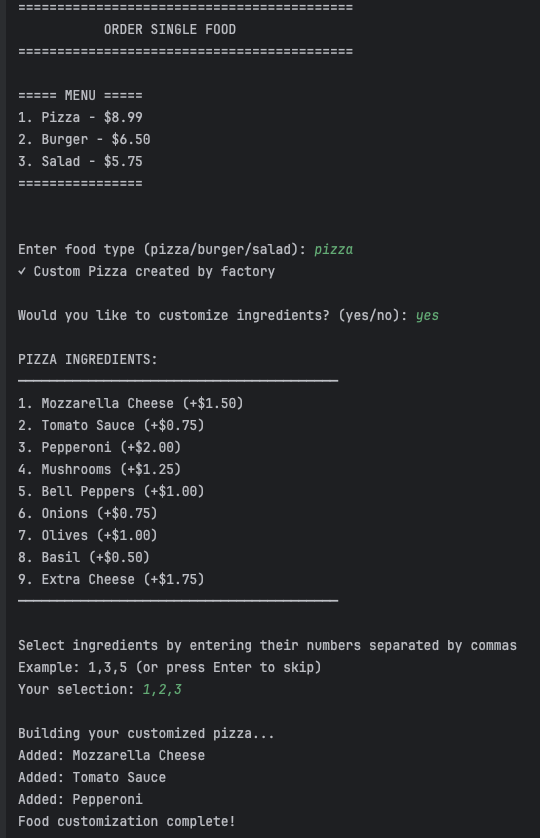
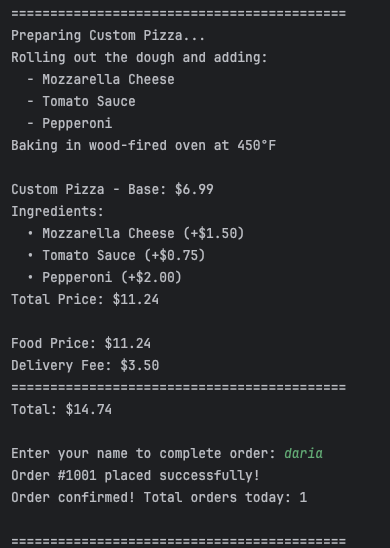
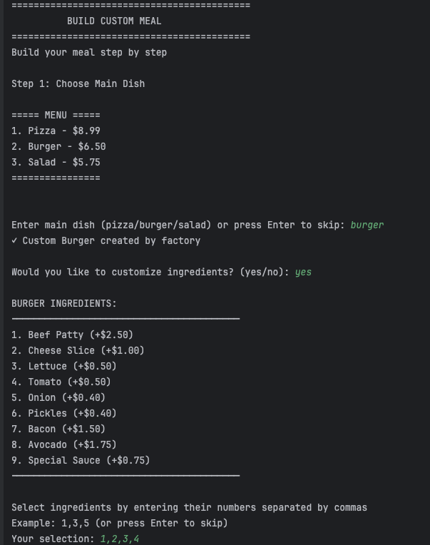
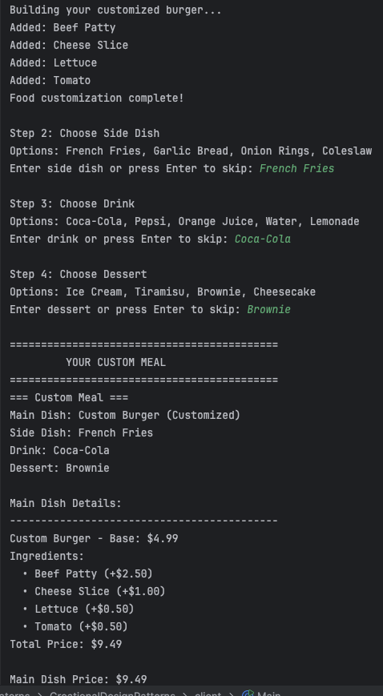
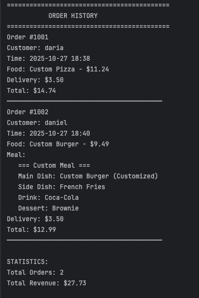

# Creational Design Patterns


## Author: Daria Ratteeva

----

## Objectives:

* Get familiar with the Creational Design Patterns;
* Choose a specific domain;
* Implement at least 3 Creational Design Patterns for the specific domain;


## Used Design Patterns:

* Singleton Pattern
* Factory Method Pattern
* Builder Pattern


## Implementation

### Singleton Pattern

The Singleton pattern ensures that a class has only one instance and provides a global point of access to it. In this project, two Singleton classes manage shared application state: **SystemConfig** handles restaurant configuration (name, status, delivery fee), and **OrderManager** tracks all orders placed during a session. Both use synchronized lazy initialization to ensure thread safety.

**SystemConfig.java:**
```
public class SystemConfig {
private static SystemConfig instance;
private double deliveryFee;
private String restaurantStatus;
private String restaurantName;
private SystemConfig() {
this.deliveryFee = 3.50;
this.restaurantStatus = "Open";
this.restaurantName = "Delicious Bites";
}

public static synchronized SystemConfig getInstance() {
if (instance == null) {
instance = new SystemConfig();
}
return instance;
}

public double getDeliveryFee() {
return deliveryFee;
}

public void setDeliveryFee(double deliveryFee) {
this.deliveryFee = deliveryFee;
}
}
```
**OrderManager.java:**
```
public class OrderManager {
private static OrderManager instance;
private List<Order> orders;
private int nextOrderId;
private OrderManager() {
this.orders = new ArrayList<>();
this.nextOrderId = 1001;
}

public static synchronized OrderManager getInstance() {
if (instance == null) {
instance = new OrderManager();
}
return instance;
}

public Order placeOrder(String customerName, Food food, Meal meal) {
Order order = new Order(nextOrderId++, customerName, food, meal);
orders.add(order);
System.out.println("Order #" + order.getId() + " placed successfully!");
return order;
}

public int getTotalOrders() {
return orders.size();
}
}
```
---

### Factory Method Pattern

The Factory Method pattern defines an interface for creating objects but lets subclasses decide which class to instantiate. The abstract **FoodFactory** class declares the factory method `createFood()`, and three concrete factories (**PizzaFactory**, **BurgerFactory**, **SaladFactory**) override this method to create specific food types. This allows the client code to work with the Food interface without knowing the concrete classes.

**FoodFactory.java (Abstract Creator):**
```
public abstract class FoodFactory {
public abstract Food createFood();
public Food orderFood() {
Food food = createFood();
System.out.println("Created: " + food.getName());
return food;
}
}
```

**PizzaFactory.java (Concrete Creator):**
```
public class PizzaFactory extends FoodFactory {
@Override
public Food createFood() {
return new Pizza();
}
}
```
**BurgerFactory.java (Concrete Creator):**
```
public class BurgerFactory extends FoodFactory {
@Override
public Food createFood() {
return new Burger();
}
}
```

**SaladFactory.java (Concrete Creator):**
```
public class SaladFactory extends FoodFactory {
@Override
public Food createFood() {
return new Salad();
}
}
```
**Usage in Main.java:**
```
FoodFactory factory = FoodFactoryProvider.getFactory("pizza");
Food food = factory.orderFood();

```
---

### Builder Pattern

The Builder pattern separates the construction of a complex object from its representation, allowing the same construction process to create different representations. The project implements two Builder variations: **MealBuilder** constructs complex Meal objects step-by-step with fluent API and optional Director, while **FoodBuilder** allows incremental ingredient customization for food items.

**IMealBuilder.java (Builder Interface):**
```
public interface IMealBuilder {
IMealBuilder setMainDish(String mainDish);
IMealBuilder setSideDish(String sideDish);
IMealBuilder setDrink(String drink);
IMealBuilder setDessert(String dessert);
IMealBuilder reset();
Meal build();
}

```
**MealBuilder.java (Concrete Builder):**
```
public class MealBuilder implements IMealBuilder {
private String mainDish;
private String sideDish;
private String drink;
private String dessert;
@Override
public IMealBuilder setMainDish(String mainDish) {
this.mainDish = mainDish;
return this;
}

@Override
public IMealBuilder setSideDish(String sideDish) {
this.sideDish = sideDish;
return this;
}

@Override
public IMealBuilder setDrink(String drink) {
this.drink = drink;
return this;
}

@Override
public IMealBuilder setDessert(String dessert) {
this.dessert = dessert;
return this;
}

@Override
public Meal build() {
return new Meal(mainDish, sideDish, drink, dessert);
}
}

```

**MealDirector.java (Director - encapsulates construction algorithms):**
```
public class MealDirector {
private IMealBuilder builder;
public MealDirector(IMealBuilder builder) {
this.builder = builder;
}

public Meal constructHealthyMeal(String mainDish) {
return builder
.reset()
.setMainDish(mainDish)
.setSideDish("Salad")
.setDrink("Water")
.build();
}

public Meal constructStandardMeal(String mainDish) {
return builder
.reset()
.setMainDish(mainDish)
.setSideDish("French Fries")
.setDrink("Coca-Cola")
.setDessert("Ice Cream")
.build();
}
```
**FoodBuilder.java (Ingredient Customization Builder):**
```
public class FoodBuilder {
private Food food;
public FoodBuilder(Food food) {
this.food = food;
}

public FoodBuilder addIngredient(Ingredient ingredient) {
if (food instanceof Pizza) {
((Pizza) food).addIngredient(ingredient);
} else if (food instanceof Burger) {
((Burger) food).addIngredient(ingredient);
} else if (food instanceof Salad) {
((Salad) food).addIngredient(ingredient);
}
return this;
}

public Food build() {
return food;
}
}
```
**Usage Examples:**
```
// Using MealBuilder directly (fluent API)
Meal customMeal = new MealBuilder()
.setMainDish("Pizza")
.setSideDish("French Fries")
.setDrink("Coca-Cola")
.setDessert("Ice Cream")
.build();

// Using MealDirector for predefined configurations
IMealBuilder builder = new MealBuilder();
MealDirector director = new MealDirector(builder);
Meal healthyMeal = director.constructHealthyMeal("Salad");

// Using FoodBuilder for ingredient customization
FoodBuilder foodBuilder = new FoodBuilder(pizza);
foodBuilder
.addIngredient(new Ingredient("Mozzarella", 1.50))
.addIngredient(new Ingredient("Tomato Sauce", 0.75))
.build();
```


## Conclusions 

This laboratory work successfully implemented three Gang of Four creational design patterns in a food ordering system domain. The **Singleton pattern** ensures centralized management of system configuration and order tracking, preventing multiple instances and providing consistent global access. The **Factory Method pattern** delegates object creation to subclasses, allowing new food types to be added without modifying existing client code, demonstrating the Open/Closed principle. The **Builder pattern** separates complex object construction from representation, supporting both fluent custom meal building and Director-controlled predefined configurations.

The project structure follows proper separation of concerns with distinct packages: `client` for the main application, `factory` for Factory Method classes, `builder` for Builder pattern implementations, `singleton` for Singleton classes, and `models` for domain entities. This modular organization makes the codebase maintainable and clearly demonstrates where each pattern is applied.

The implementation proves that creational patterns are not isolated solutions but work harmoniously together—factories create objects, builders assemble them into complex structures, and singletons manage shared state. Future extensions could easily add new food types through additional factory subclasses, new meal combinations through director methods, or new global services as singletons, all without breaking existing functionality. This demonstrates the core value of design patterns: creating flexible, maintainable, and extensible software architectures.

## Screenshots 









