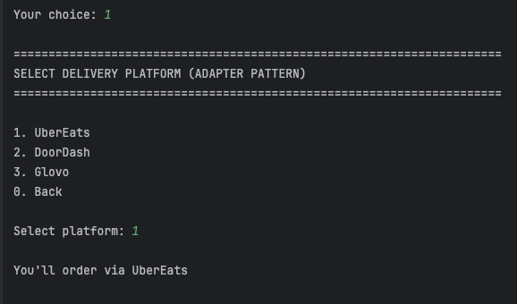
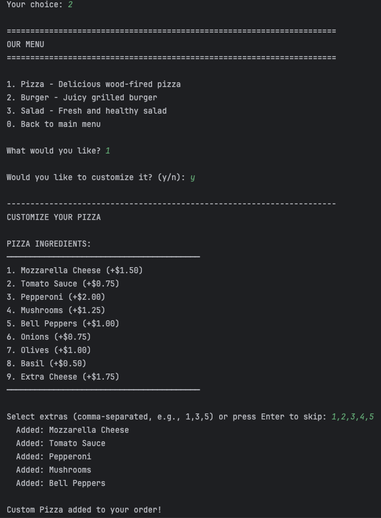
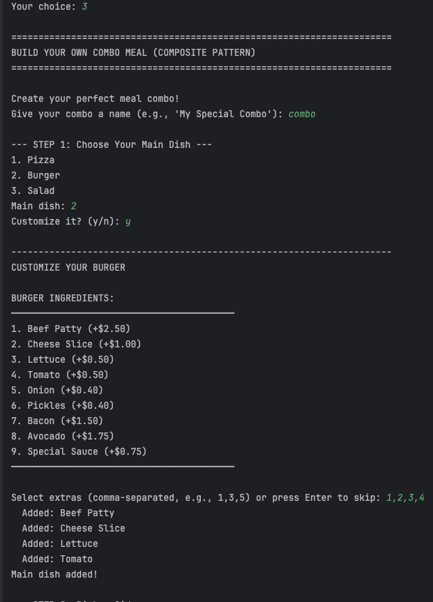
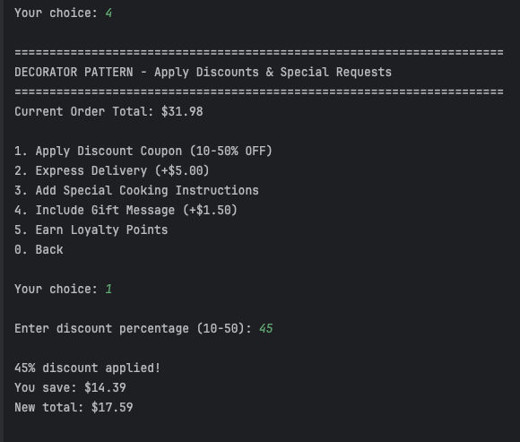
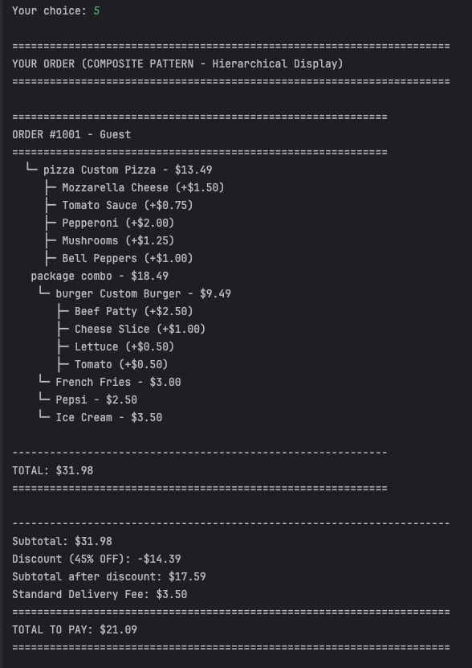

# Structural Design Patterns

## Author: Daria Ratteeva

----

## Objectives:

* Study and understand the Structural Design Patterns
* As a continuation of the previous laboratory work, think about the functionalities that the system will need to provide to the user
* Implement at least 3 Structural Design Patterns for the specific domain

## Used Design Patterns:

* Adapter Pattern
* Decorator Pattern
* Composite Pattern

## Implementation

### Adapter Pattern

The Adapter pattern allows incompatible interfaces to work together by converting one interface into another that clients expect. In this project, adapters enable integration with external payment gateways (Stripe, PayPal) and delivery platforms (UberEats, DoorDash) without modifying the core application logic.

**Location:** `adapter/` package

**Structure:**
- **Target Interfaces:** `PaymentProcessor`, `DeliveryPlatform`
- **Adapters:** `StripeAdapter`, `PayPalAdapter`, `UberEatsAdapter`, `DoorDashAdapter`
- **Adaptees:** External APIs with incompatible interfaces

**Key Implementation - StripeAdapter.java:**

The Stripe API expects customer IDs and amounts in cents, while our system works with customer names and dollar amounts. The adapter bridges this gap:


```
public class StripeAdapter implements PaymentProcessor {
@Override
public boolean processPayment(String customerName, double amount) {
String customerId = "cus_" + customerName.hashCode();
int amountInCents = (int)(amount * 100);
return stripePayment.charge(customerId, amountInCents);
}
}
```

**Key Implementation - UberEatsAdapter.java:**

UberEats requires menu items in JSON format with specific fields, while our system uses Food objects:
```
public class UberEatsAdapter implements DeliveryPlatform {
@Override
public boolean publishMenuItem(Food food) {
String jsonData = String.format(
"{"dish_name": "%s", "price_usd": %.2f}",
food.getName(), food.getPrice()
);
return uberEatsAPI.addMenuItem(jsonData);
}
}
```

**Motivation:**

Each payment gateway and delivery platform has its own API format—Stripe uses cents and customer IDs, PayPal uses email addresses, UberEats expects JSON, DoorDash requires XML. Without adapters, the system would need separate code paths for each service, violating the Open/Closed Principle. Adapters provide a unified interface (`PaymentProcessor` and `DeliveryPlatform`), making it trivial to add new services without changing existing code. The system can now support any payment method or delivery platform by simply creating a new adapter.

---

### Decorator Pattern

The Decorator pattern dynamically adds responsibilities to objects without modifying their structure. The system uses decorators to enhance food orders with optional features like express delivery, discount coupons, loyalty points, and special occasion messages.

**Location:** `decorator/` package

**Structure:**
- **Component Interface:** `Food`
- **Concrete Components:** `Pizza`, `Burger`, `Salad`
- **Abstract Decorator:** `FoodDecorator`
- **Concrete Decorators:** `ExpressDeliveryDecorator`, `DiscountCouponDecorator`, `LoyaltyPointsDecorator`, `SpecialOccasionDecorator`

**Key Implementation - FoodDecorator.java:**
```
public abstract class FoodDecorator implements Food {
protected Food decoratedFood;

public FoodDecorator(Food food) {
this.decoratedFood = food;
}

@Override
public void prepare() {
decoratedFood.prepare();
}
}
```

**Key Implementation - DiscountCouponDecorator.java:**


```
public abstract class FoodDecorator implements Food {
protected Food decoratedFood;
@Override
public double getPrice() {
double originalPrice = decoratedFood.getPrice();
return originalPrice - (originalPrice * discountPercentage / 100.0);
}
}
```
**Usage Example:**
```
// Stack multiple decorators dynamically
Food burger = new Burger();
burger = new DiscountCouponDecorator(burger, 20.0);
burger = new ExpressDeliveryDecorator(burger);
burger = new LoyaltyPointsDecorator(burger);
```


**Motivation:**

Without decorators, each combination of features would require a separate subclass: `ExpressPizza`, `DiscountedPizza`, `ExpressDiscountedPizza`, etc. With just 4 enhancement options, there would be 16 combinations, leading to class explosion. Decorators solve this by allowing dynamic composition at runtime. Customers can add any combination of enhancements to any food item, and the system automatically calculates the correct price. This demonstrates the Open/Closed Principle: new decorators can be added without modifying existing food classes.

---

### Composite Pattern

The Composite pattern composes objects into tree structures to represent part-whole hierarchies. It allows clients to treat individual objects and compositions uniformly. In this system, the pattern manages hierarchical order structures where orders contain order items (combo meals), which contain individual food items.

**Location:** `composite/` package

**Structure:**
- **Component Interface:** `MenuComponent`
- **Leaf Classes:** `SimpleItem`, `Pizza`, `Burger`, `Salad`
- **Composite Classes:** `Order`, `OrderItem`

**Key Implementation - MenuComponent.java:**
```
public interface MenuComponent {
String getName();
double getPrice();
void display(int level);

default void add(MenuComponent component) {
throw new UnsupportedOperationException("Cannot add to a leaf node");
}
}
```

**Key Implementation - Order.java (Composite):**
```
public class Order implements MenuComponent {
private List<MenuComponent> items = new ArrayList<>();
@Override
public double getPrice() {
return items.stream()
.mapToDouble(MenuComponent::getPrice)
.sum();
}

@Override
public void display(int level) {
for (MenuComponent item : items) {
item.display(1); // Recursive call
}
}
}
```

**Usage Example:**
```
Order order = new Order(1001, "John Doe");
order.add(new SimpleItem("French Fries", 2.99));

// Create a combo meal (composite within composite)
OrderItem combo = new OrderItem("Family Combo");
combo.add(new Pizza());
combo.add(new Burger());
order.add(combo);

order.display(0); // Displays entire hierarchy with proper indentation

```
**Output Example:**
```
============================================================
ORDER #1001 - John Doe
└─ French Fries - $2.99
📦 Family Combo - $11.98
└─ Custom Pizza - $6.99
└─ Custom Burger - $4.99

TOTAL: $14.97
```

**Tree Structure:**
```
Order (Composite)
├── SimpleItem (Leaf)
└── OrderItem (Composite)
├── Pizza (Leaf)
└── Burger (Leaf)
```


**Motivation:**

Without the Composite pattern, handling individual items versus combo meals would require type checking and separate logic paths. The Composite pattern solves this by providing uniform treatment—whether adding a single item or an entire combo meal, the interface remains the same. Price calculation is automatic through recursive aggregation: `Order.getPrice()` calls `getPrice()` on all children, which recursively call their children, naturally computing the total. The `display()` method demonstrates recursive tree traversal with proper indentation. This makes the system highly extensible—new composite structures can be added without modifying existing code.

---

## Conclusions

This laboratory work successfully implemented three structural design patterns in the food ordering system, building upon the creational patterns from the previous lab.

The **Adapter pattern** enables seamless integration with multiple external services by converting incompatible interfaces, demonstrating system extensibility. Payment gateways (Stripe, PayPal) and delivery platforms (UberEats, DoorDash) can be integrated without modifying core logic.

The **Decorator pattern** provides runtime flexibility by dynamically adding optional features without modifying core classes. Customers can combine discounts, express delivery, loyalty points, and special occasions in any configuration, exemplifying the Open/Closed Principle and avoiding class explosion.

The **Composite pattern** manages hierarchical order structures through uniform treatment, enabling recursive operations like price calculation and tree visualization. Orders can contain individual items or combo meals (which contain multiple items), all accessed through the same interface.

The project maintains clean separation of concerns with packages: `adapter/`, `decorator/`, `composite/`, `factory/`, `builder/`, `singleton/`, `models/`, and `client/`. This modular architecture demonstrates how creational and structural patterns work together harmoniously—factories create objects, builders assemble them, decorators enhance them dynamically, adapters integrate external systems, and composites organize them into hierarchies.

These patterns enable the system to integrate external services, provide flexible customization, and manage complex structures—all while maintaining clean, maintainable code adhering to SOLID principles. Future extensions could add new services through adapters, new enhancements through decorators, or complex hierarchies through composites—all without modifying existing code.


## Screenshots












S
