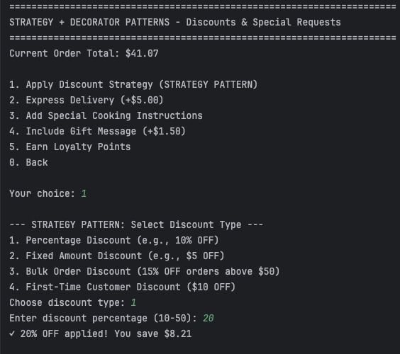
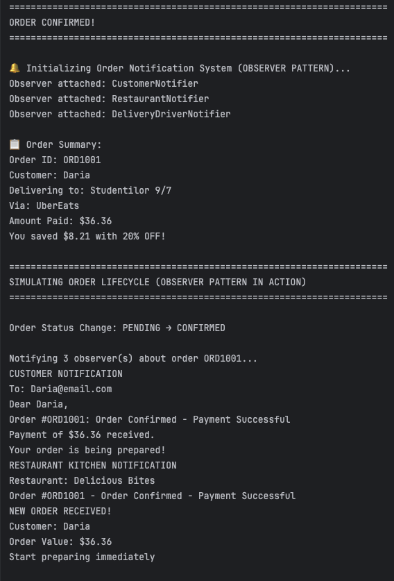
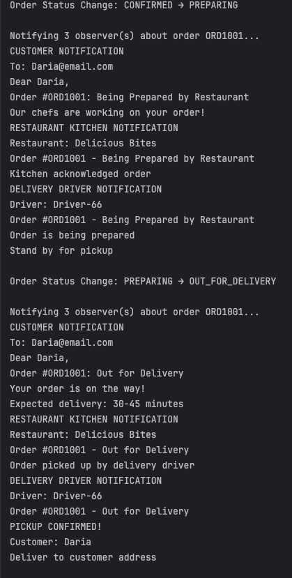
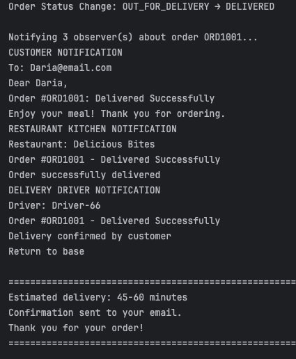

# Structural Design Patterns

## Author: Daria Ratteeva

----

## Objectives:

* Study and understand the Behavioral Design Patterns
* As a continuation of the previous laboratory work, think about what communication between software entities might be involved in the system
* Implement at least 1 behavioral design pattern to add additional functionalities to the existing system

## Used Design Patterns:

* Strategy Pattern
* Observer Pattern

## Implementation

### Strategy Pattern

The Strategy pattern defines a family of algorithms, encapsulates each one, and makes them interchangeable. Strategy lets the algorithm vary independently from clients that use it. In this project, the Strategy pattern manages different discount calculation algorithms, allowing the system to apply various discount types dynamically at runtime without modifying the context code.

**Location:** `strategy/` package

**Structure:**
- **Strategy Interface** `DiscountStrategy`
- **Concrete Strategies:** `PercentageDiscount`, `FixedAmountDiscount`, `BulkOrderDiscount`, `FirstTimeCustomerDiscount`, `NoDiscount`
- **Context:** `Main` class (holds reference to `DiscountStrategy`)

**Key Implementation - DiscountStrategy.java:**

The strategy interface defines the contract all discount algorithms must follow:


```
public interface DiscountStrategy {
    double calculateDiscount(double orderSubtotal);
    String getDescription();
}

```

**Key Implementation - PercentageDiscount.java:**

Implements percentage-based discount calculation:

```
public class PercentageDiscount implements DiscountStrategy {
    private double percentage;
    
    public PercentageDiscount(double percentage) {
        if (percentage < 0 || percentage > 100) {
            throw new IllegalArgumentException("Percentage must be between 0 and 100");
        }
        this.percentage = percentage;
    }
    
    @Override
    public double calculateDiscount(double orderSubtotal) {
        return orderSubtotal * (percentage / 100.0);
    }
    
    @Override
    public String getDescription() {
        return String.format("%.0f%% OFF", percentage);
    }
}

```

**Key Implementation - BulkOrderDiscount.java:**

Conditional discount strategy that applies only when order exceeds threshold:

```
public class BulkOrderDiscount implements DiscountStrategy {
    private double threshold;
    private double discountPercentage;
    
    @Override
    public double calculateDiscount(double orderSubtotal) {
        if (orderSubtotal >= threshold) {
            return orderSubtotal * (discountPercentage / 100.0);
        }
        return 0.0; // No discount if below threshold
    }
    
    @Override
    public String getDescription() {
        return String.format("%.0f%% OFF on orders above $%.2f", 
            discountPercentage, threshold);
    }
}
```

**Motivation:**

Before implementing the Strategy pattern, the system used a simple appliedDiscountPercent variable with hardcoded logic. This approach had several problems: it only supported percentage discounts, required conditional statements scattered throughout the code, and violated the Open/Closed Principle. Adding new discount types (fixed amount, bulk order, first-time customer) would require modifying existing methods, increasing complexity and maintenance burden.

The Strategy pattern solves these issues by encapsulating each discount algorithm in its own class. The Main class (context) works only with the DiscountStrategy interface, remaining completely independent of concrete implementations. New discount strategies can be added by simply creating new classes implementing DiscountStrategy, without touching existing code. The pattern also enables runtime flexibility—users can switch between discount types during a single session, and strategies can contain complex logic (like BulkOrderDiscount checking thresholds) without cluttering the context.

This demonstrates key behavioral pattern characteristics: the pattern defines how objects collaborate and communicate, with the context delegating the discount calculation algorithm to strategy objects at runtime.

---

### Observer Pattern

The Observer pattern defines a one-to-many dependency between objects so that when one object changes state, all its dependents are notified and updated automatically. In this project, the Observer pattern manages order status notifications, allowing multiple stakeholders (customers, restaurant staff, delivery drivers) to receive automatic updates when order status changes.
**Location:** `observer/` package

**Structure:**
- **Subject/Publisher:** `OrderSubject`
- **Observer Interface:** `OrderObserver`
- **Concrete Observers:** `CustomerNotifier`, `RestaurantNotifier`, `DeliveryDriverNotifier`,
- **State Enumeration:** `OrderStatus`

**Key Implementation - OrderObserver.java:**

The observer interface defines the update contract:

```
public interface OrderObserver {
    void update(String orderId, OrderStatus status, 
                String customerName, double totalAmount);
}

```

**Key Implementation - OrderSubject.java:**

The subject maintains observer list and notifies on state changes:

```
public class OrderSubject {
    private List<OrderObserver> observers;
    private String orderId;
    private OrderStatus currentStatus;
    private String customerName;
    private double totalAmount;
    
    public OrderSubject(String orderId, String customerName, double totalAmount) {
        this.observers = new ArrayList<>();
        this.orderId = orderId;
        this.customerName = customerName;
        this.totalAmount = totalAmount;
        this.currentStatus = OrderStatus.PENDING;
    }
    
    public void attach(OrderObserver observer) {
        if (!observers.contains(observer)) {
            observers.add(observer);
            System.out.println("✓ Observer attached: " + 
                observer.getClass().getSimpleName());
        }
    }
    
    public void detach(OrderObserver observer) {
        observers.remove(observer);
    }
    
    private void notifyObservers() {
        System.out.println("\n Notifying " + observers.size() + 
            " observer(s) about order " + orderId + "...");
        for (OrderObserver observer : observers) {
            observer.update(orderId, currentStatus, customerName, totalAmount);
        }
    }
    
    public void setStatus(OrderStatus newStatus) {
        System.out.println("\n Order Status Change: " + 
            currentStatus + " → " + newStatus);
        this.currentStatus = newStatus;
        notifyObservers(); // Automatically notify all observers
    }
}

```


**Motivation:**

Before implementing the Observer pattern, order status tracking was non-existent—once payment succeeded, there was no mechanism to notify stakeholders about order progress. Implementing notifications manually would require coupling the order processing logic with notification code for each stakeholder, violating the Single Responsibility Principle.

The Observer pattern elegantly solves this by establishing a one-to-many relationship between the order (subject) and stakeholders (observers). The OrderSubject maintains a list of observers and automatically notifies all of them whenever setStatus() is called. This loose coupling means the subject doesn't need to know the concrete classes of observers—it only knows they implement OrderObserver.

Each observer can react differently to the same event: CustomerNotifier sends user-friendly messages, RestaurantNotifier alerts kitchen staff, and DeliveryDriverNotifier selectively filters only relevant states. New observers can be added (e.g., InventoryManager, AnalyticsDashboard) without modifying OrderSubject, demonstrating the Open/Closed Principle.

The pattern demonstrates key behavioral characteristics: it defines communication protocols between objects, with the subject broadcasting state changes and observers reacting independently. This creates a publish-subscribe relationship where objects collaborate without tight coupling.

---

## Conclusions

This laboratory work successfully implemented two behavioral design patterns in the food ordering system, extending the functionality built in previous labs with creational and structural patterns.

The Strategy pattern enables flexible discount calculation by encapsulating different pricing algorithms into interchangeable strategy objects. The system now supports percentage discounts, fixed-amount discounts, bulk order discounts, and first-time customer promotions—all selectable at runtime without modifying the context code. This demonstrates the Open/Closed Principle: new discount strategies can be added by creating new classes implementing DiscountStrategy, requiring zero changes to existing code. The pattern eliminates conditional statements and prevents class explosion that would occur with inheritance-based approaches.

The Observer pattern establishes automatic notification system for order status tracking. When an order transitions through states (PENDING → CONFIRMED → PREPARING → OUT_FOR_DELIVERY → DELIVERED), all registered observers receive updates simultaneously. The OrderSubject maintains loose coupling with observers, knowing them only through the OrderObserver interface. This allows CustomerNotifier, RestaurantNotifier, and DeliveryDriverNotifier to react independently to the same events, each implementing custom notification logic. New observers can be dynamically attached or detached at runtime without affecting the subject or other observers.

Both behavioral patterns focus on communication and collaboration between objects rather than object creation (creational patterns) or object composition (structural patterns). Strategy defines how algorithms are selected and executed, while Observer defines how state changes are propagated across multiple dependent objects. Together, they enable the system to handle complex business logic with clean, maintainable code.

The project now demonstrates a complete design pattern ecosystem: Factory and Builder patterns create objects, Singleton manages global configuration, Adapter integrates external services, Decorator adds dynamic features, Composite organizes hierarchies, Strategy manages algorithms, and Observer coordinates notifications. This layered architecture maintains clear separation of concerns with packages: factory/, builder/, singleton/, adapter/, decorator/, composite/, strategy/, observer/, models/, and client/.

The behavioral patterns enhance the system's flexibility and extensibility while adhering to SOLID principles. Future extensions could add new discount strategies (seasonal promotions, loyalty tiers, referral bonuses) through the Strategy pattern, or new notification channels (SMS, push notifications, email) through the Observer pattern—all without modifying existing code. The system successfully demonstrates how design patterns work together harmoniously to create robust, maintainable, and extensible software architectures.

## Screenshots









